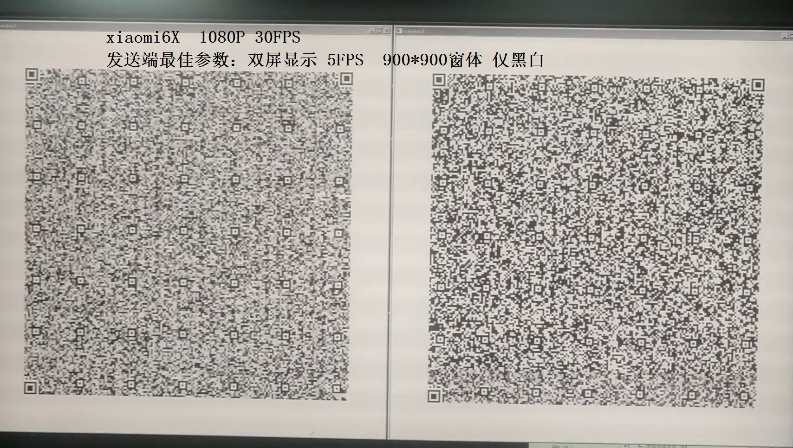
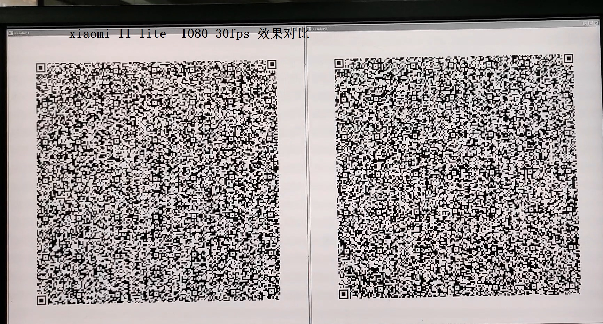

二维码 内外网传输
QRCODE 瀑布流传输

二维码基础知识
https://tuz.im/blog/233.html

https://segno.readthedocs.io/en/stable/index.html

# 优化经验
# wechat的QRCODE识别
##### https://www.cnblogs.com/shuimuqingyang/p/14356271.html
##### https://github.com/Kazuhito00/OpenCV-QRCodeDetector-Sample
##### https://blog.csdn.net/qq_41035283/article/details/118379762
##### https://blog.csdn.net/weixin_40446557/article/details/116845893
##### 需要opencv-python 4.5.3.56 or later

## 小米6X 后置2KW像素 拍1080 30FPS 

### 发送端 （ 1M文件 需录2分钟）
#### 5帧最稳定，不要再高了。再高了摄像模糊无法识别
#### RGB 3层叠加二维码，效果不好，很模糊，无法识别。可能可以采用2色：红 绿，白 黑
#### 1920 X 1080的 二个二维码同时显示 每个二维码 900 X 900分辨率 比较好，三个二维码600 X 600的识别率不是很高。不如只用2个的。

### 接收端
#### 彩色识别下 然后灰色识别下 ，然后二值化识别即可，其他的没用又影响速度

### 测试
#### 1.7M的文件：录制 30FPS 1080P 3分钟， 接收端处理3065帧，21KB/S 处理80S 识别5283张二维码
#### 3.4M的文件：录制 30FPS 1080P 4.5分钟， 接收端处理6200帧，20KB/S 处理173S 识别10056张二维码

## 小米11 lite 后置6KW像素 拍1080 30FPS

### 发送端  （ 1M文件 需录1分钟）
#### 10帧
#### RGB 3层叠加二维码，效果不好，很模糊，无法识别。可能可以采用2色：红 绿，白 黑
#### 1920 X 1080的 三个二维码600 X 600的识别率 识别率还可以，但是CPU太卡，上不到10帧。所以用 二个二维码 显示比较好。

### 接收端
#### 彩色识别下 然后灰色识别下 ，然后二值化识别即可，其他的没用又影响速度

### 测试
#### 6.3M的文件：录制 30FPS 1080P 4.5分钟， 接收端处理6122帧，27KB/S 处理234S 识别10533张二维码
#### 6.8M的文件：录制 30FPS 1080P 6分钟， 接收端处理9402帧，7KB/S 处理920S 识别7836张二维码

# blinqr
A prototype implementation of an unidirectional connectionless stateless data transfer protocol using QR and LT codes to send small files from a computer to a mobile device.


This is a Python version of [Animated QR data transfer with Gomobile and Gopherjs](https://divan.dev/posts/animatedqr/) realised as an assignment for my studies.

## Prerequisites
* Python 3.7           3.6 也可以
* Tkinter
* zbar 0.10 (http://zbar.sourceforge.net/download.html)
* DroidCam 6.0 (https://www.dev47apps.com/)

## Installation
```bash
pip install -r requirements.txt
```

## Usage
1. Connect your Android device to the computer using DroidCam 6.0 via USB or Wi-Fi.
2. Launch the sender:
    ```bash
    python sender.py
    ```
3. Select a file to send.
4. Launch the receiver:
    ```bash
    python receiver.py
    ```
   **Note:** If an orange box is displayed instead of the transmitted image, you may need to reinstall DroidCam and restart your computer. This is probably a DroidCam Client issue.
5. Point the camera at the computer screen. Try to keep QR codes in the frame. Each time a QR code is detected, a blue border will appear. Don't worry about dropped frames – blinqr also encodes data using fountain code. That allows data to be recovered from any feasible subset of transmitted QR codes.
6. Wait until the file is received. Transfer speed is about 5 kB/s, but it strongly depends on the computational capabilities of your computer.
7. When the transfer is complete, compare SHA-1 hashes calculated both by sender and receiver for the sake of certainty.
8. Press <kbd>q</kbd> to exit.

## Further development

**Performance**
* Parallelize QR codes generation
  * Consider switching to other low-level library
* Use RGB QR codes instead of standard QR codes
  * Create a native mobile app to resolve issues with color identification and focusing
* Find optimal combination of block size and data encoding method
* Resolve screen response time issues
  * Consider using a constant frame rate
* Differentiate transmissions by adding transmission ID

**User Experience**
* Improve GUI
* Show progress information and calculate ETA
* Include original file name in the transmission
* Allow sending entire directories by automatically compressing its contents into single .zip archive file

**Refactoring**
* Use Python streams
* Convert into package
  * Provide simple API for sending and receiving files
* Add tests and examples
